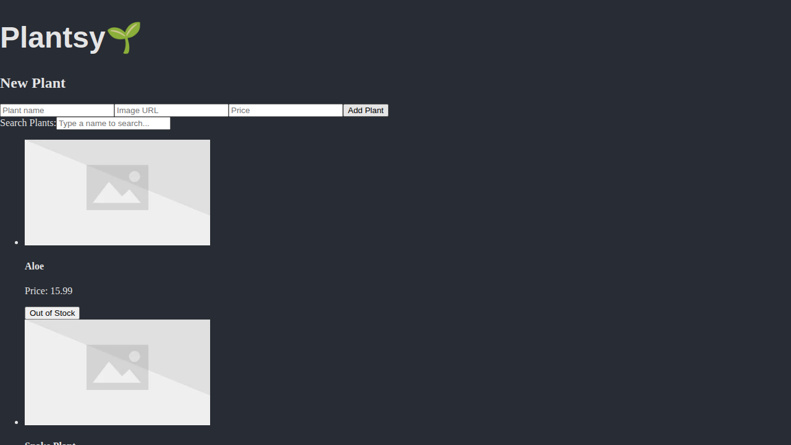

# Plantsy

Welcome to **Plantsy**, your one-stop shop for all things green! This application allows you to manage a collection of plants, see what's in stock, and search for your favorites.

## Features

- **View Plants:** See all available plants on page load.
- **Add New Plant:** Use the form to add a new plant to the collection.
- **Stock Management:** Mark plants as "sold out" or "in stock".
- **Search:** Filter plants by name to quickly find what you're looking for.

## Getting Started

### Prerequisites

- Node.js (version 14 or higher)
- npm

### Installation

1. Clone the repository.
2. Install dependencies:
   ```bash
   npm install
   ```

### Running the Project

1. Start the backend server:
   ```bash
   npm run server
   ```
   This will start a mock backend on `http://localhost:6001`.

2. Start the development server:
   ```bash
   npm run dev
   ```

3. Open your browser and navigate to `http://localhost:5173`.

### Running Tests

To run the test suite:
```bash
npm run test
```

## Screenshot



## Implementation Details

- Built with **React**.
- Uses **JSON Server** for the mock backend.
- Manages state with `useState` and handles side effects with `useEffect`.
